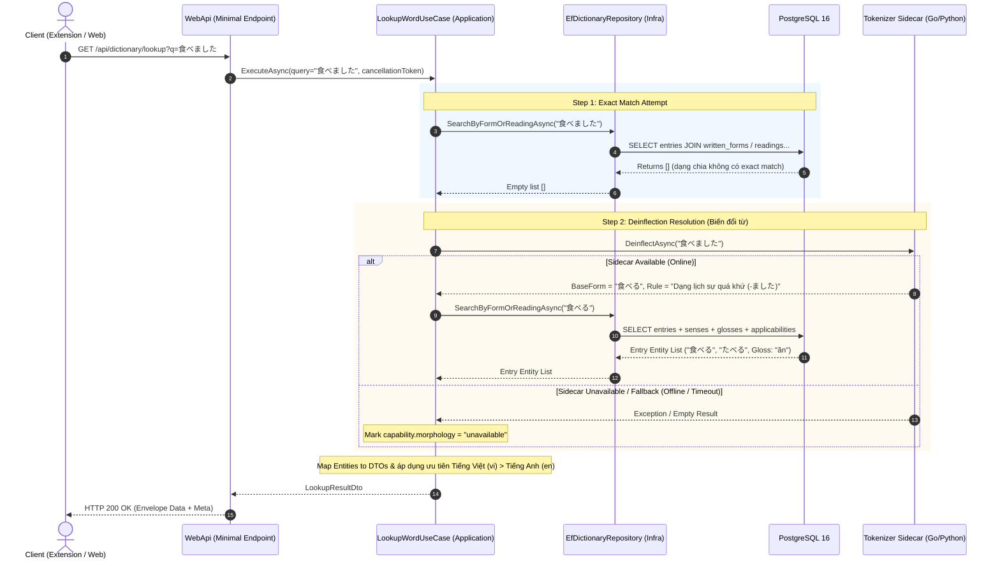

# Implementation Plan: Dictionary Lookup API (`feat-dict-lookup`)

**Version:** 1.1.0 | **Date:** 2026-08-22  
**Target Feature:** `feat-dict-lookup` (F-06 Vocabulary Lookup API)  
**Spec Reference:** [SPEC.md](./SPEC.md)  
**Governing Laws:** `AGENTS.md` (Clean Architecture), `REQUIREMENT.md`, `docs/api/mvp-api-contract.md`

---

## 1. Overview & Architecture Strategy

Tính năng **Dictionary Lookup API** cung cấp khả năng tra cứu từ vựng tiếng Nhật tập trung (Server-Authoritative) trên nền tảng .NET 10 & PostgreSQL 16.

### 1.1 Layer Breakdown (Clean Architecture)

```
[ WebApi ]                GET /api/dictionary/lookup?q={query}
    │
    ▼
[ Application ]           LookupWordUseCase, DTOs, IDictionaryRepository, ITokenizerAdapter
    │
    ▼
[ Domain ]                DictionaryEntry, WrittenForm, Reading, DictionarySense, LocalizedGloss, SenseApplicability
    ▲
    │
[ Infrastructure ]        EfDictionaryRepository, Null/SidecarAdapter, AppDbContext
```

1. **Domain Layer (`src/domain`)**: Pure POCOs (18 entities đã có). Tạo các Value Objects/Domain Exceptions nếu cần. **Zero external imports**.
2. **Application Layer (`src/usecase`)**:
   - Định nghĩa Abstractions: `IDictionaryRepository`, `ITokenizerAdapter`.
   - DTOs: `LookupResultDto`, `EntryMatchDto`, `SenseDto`, `GlossDto`, `ConjugationDto`.
   - Use Case: `LookupWordUseCase`.
3. **Infrastructure Layer (`src/infra`)**:
   - Implement `EfDictionaryRepository` truy vấn EF Core 10 & PostgreSQL 16 (eager loading `Include`/`ThenInclude`, không N+1).
   - Implement `NullTokenizerAdapter` (Fallback adapter khi Sidecar offline) hoặc HTTP Sidecar Client.
4. **WebApi Layer (`src/interface`)**:
   - Minimal API route mapping `GET /api/dictionary/lookup` (hoặc `/api/v2/dictionary/lookup`).
   - Exception handling & Structured JSON errors (`VALIDATION_FAILED`, `SERVICE_UNAVAILABLE`, `RATE_LIMITED`).
   - DI Extension methods (`AddApplicationServices()`, `AddInfrastructureServices()`).

### 1.2 Data Flow Sequence Diagram

Sơ đồ thể hiện luồng tra cứu bất đồng bộ xử lý exact match, deinflection fallback và graceful degradation:



---

## 2. Phase-by-Phase Execution Plan

### 🚀 Phase 1: Application Layer Core Abstractions & Use Case

#### Objectives
Tạo các hợp đồng (Interfaces), DTOs và Use Case nghiệp vụ độc lập hoàn toàn với ORM hay HTTP Framework.

#### Tasks
- [ ] **1.1. Abstractions (Ports)**
  - Tạo `src/usecase/Dictionary/Ports/IDictionaryRepository.cs`:
    - `Task<IReadOnlyList<DictionaryEntry>> SearchByFormOrReadingAsync(string query, CancellationToken cancellationToken);`
    - `Task<IReadOnlyList<DictionaryEntry>> GetByCanonicalIdsAsync(IEnumerable<string> canonicalIds, CancellationToken cancellationToken);`
  - Tạo `src/usecase/Dictionary/Ports/ITokenizerAdapter.cs`:
    - `Task<DeinflectionResult> DeinflectAsync(string surfaceText, CancellationToken cancellationToken);`
- [ ] **1.2. Data Transfer Objects (DTOs)**
  - `LookupResultDto`: Chứa `IReadOnlyList<EntryMatchDto> Matches`, `ConjugationDto? Conjugation`, `CapabilityStatus Capability`.
  - `EntryMatchDto`: `CanonicalId`, `MatchedWrittenForm`, `MatchedReading`, `Senses`, `WrittenForms`, `Readings`.
  - `SenseDto`: `SenseKey`, `PartOfSpeech`, `Glosses` (tiếng Việt ưu tiên, tiếng Anh fallback), `Restrictions`.
- [ ] **1.3. Use Case Logic (`LookupWordUseCase`)**
  - Validation: Kiểm tra query `q` rỗng/whitespace/dài > 255 chars → ném `ArgumentException` hoặc `ValidationException`.
  - Step 1: Tra cứu Exact Match qua `IDictionaryRepository.SearchByFormOrReadingAsync(query)`.
  - Step 2: Nếu chưa tìm thấy exact match (hoặc song song): gọi `ITokenizerAdapter.DeinflectAsync(query)` để lấy base form.
  - Step 3: Map Entities sang DTOs tuân thủ ưu tiên tiếng Việt (`language_tag = 'vi'`) và bảo toàn restriction `sense_applicabilities`.
- [ ] **1.4. Unit Tests (`tests/unit`)**
  - Viết `LookupWordUseCaseTests.cs`:
    - Test validation logic (query rỗng, query quá dài).
    - Test mapping tiếng Việt ưu tiên / English fallback.
    - Test handling khi Tokenizer Adapter fail (Graceful degradation).

---

### 📦 Phase 2: Infrastructure Implementation (EF Core & Sidecar)

#### Objectives
Hiện thực hóa Repository truy vấn cơ sở dữ liệu PostgreSQL 16 thật thông qua EF Core và Sidecar Adapter.

#### Tasks
- [ ] **2.1. EF Core Repository (`EfDictionaryRepository`)**
  - Tạo `src/infra/Persistence/Repositories/EfDictionaryRepository.cs` kế thừa `IDictionaryRepository`:
    - Query trên `AppDbContext.DictionaryEntries`.
    - Eager loading đầy đủ: `.Include(e => e.WrittenForms)`, `.Include(e => e.Readings)`, `.Include(e => e.Senses).ThenInclude(s => s.Glosses)`, `.Include(e => e.Senses).ThenInclude(s => s.Applicabilities)`.
    - Index utilization: Tận dụng index trên `written_forms.form` (`idx_written_forms_form`) và `readings.reading` (`idx_readings_reading`).
- [ ] **2.2. Sidecar Deinflection Adapter (`NullTokenizerAdapter` / `SidecarHttpClientAdapter`)**
  - Implement `NullTokenizerAdapter.cs` làm fallback default (trả `DeinflectionResult.Empty`) để hệ thống luôn chạy được độc lập không phụ thuộc sidecar container trong dev mode.
- [ ] **2.3. Dependency Injection Configuration**
  - Tạo `src/infra/DependencyInjection.cs` để đăng ký `AppDbContext`, `IDictionaryRepository`, `ITokenizerAdapter`.

---

### 🌐 Phase 3: WebApi Layer & Endpoint Registration

#### Objectives
Phơi bày (expose) API ra ngoài qua Minimal API, áp dụng Validation và Structured Error Response.

#### Tasks
- [ ] **3.1. Minimal API Endpoint**
  - Tạo `src/interface/Endpoints/DictionaryEndpoints.cs`:
    - Route: `GET /api/dictionary/lookup?q={query}`
    - Hỗ trợ header `X-Contract-Version`.
- [ ] **3.2. Global Error Handling & Response Envelope**
  - Xử lý các lỗi:
    - Validation error (400 Bad Request) -> JSON `{ "error_code": "VALIDATION_FAILED", "message": "...", "request_id": "..." }`.
    - DB / Timeout error (503 Service Unavailable) -> JSON `{ "error_code": "SERVICE_UNAVAILABLE", ... }`.
  - Đảm bảo query rỗng/vô nghĩa trả về 200 OK kèm danh sách rỗng `[]` (AC-007).
- [ ] **3.3. Update `Program.cs`**
  - Đăng ký DI cho Application & Infrastructure services.
  - Map Dictionary Endpoints.

---

### 🧪 Phase 4: Integration Testing & Verification

#### Objectives
Chạy suite test tích hợp thực tế với PostgreSQL 16 (Docker Testcontainers) để đảm bảo query EF Core và Schema khớp 100%.

#### Tasks
- [ ] **4.1. Integration Test Suite (`tests/integration`)**
  - Tạo `DictionaryLookupIntegrationTests.cs` (kế thừa `PostgreSqlFixture`):
    - **AC-001 (Exact Match):** Seed dữ liệu từ `日本語` -> Tra cứu trả về HTTP 200 & đúng canonical ID.
    - **AC-002 (Language Priority):** Seed entry có cả nghĩa `vi` và `en` -> Verify nghĩa `vi` đứng đầu.
    - **AC-003 (Empty State):** Tra cứu từ vô nghĩa `asdfghjkl` -> Verify HTTP 200 & `[]`.
    - **AC-004 (Validation):** Tra cứu `q=` hoặc `q` > 255 chars -> Verify HTTP 400 & Error envelope.
    - **AC-005 (Restriction Provenance):** Entry có `sense_applicabilities` -> Verify dữ liệu restriction không bị rò rỉ hoặc mất mát.
- [ ] **4.2. Build & Test Pass Verification**
  - Run `dotnet build` -> 0 Errors, 0 Warnings.
  - Run `dotnet test` -> All Unit & Integration tests PASSED.

---

## 3. Dependency & Risk Matrix

| Risk / Dependency | Impact | Mitigation Strategy |
|---|---|---|
| EF Core Query Performance (N+1 query) | High (Chậm P95 > 200ms) | Dùng `.Include()` hợp lý, kiểm tra SQL do EF Core sinh ra bằng Logging trong Integration Test. |
| Sidecar Container chưa sẵn sàng | Medium (Không deinflect được) | Triển khai `NullTokenizerAdapter` trước làm Fallback; API vẫn trả Exact Match bình thường (`capabilities.morphology = "unavailable"`). |
| Data restriction phức tạp (`sense_applicabilities`) | Medium (Gắn sai nghĩa) | Viết unit/integration test riêng cho case restricted forms/readings. |

---

## 4. Definition of Done (DoD)

1. [ ] Code tuân thủ nghiêm ngặt 4 layer của Clean Architecture.
2. [ ] Layer Domain không chứa dependency ngoài.
3. [ ] Mọi Error response (≥ 400) trả về đúng format `{ error_code, message, request_id }`.
4. [ ] Build solution `0 Error, 0 Warning`.
5. [ ] 100% các Acceptance Criteria (AC-001 đến AC-013 trong SPEC.md) được phủ bởi Unit Tests và Integration Tests (PostgreSQL Testcontainers).
